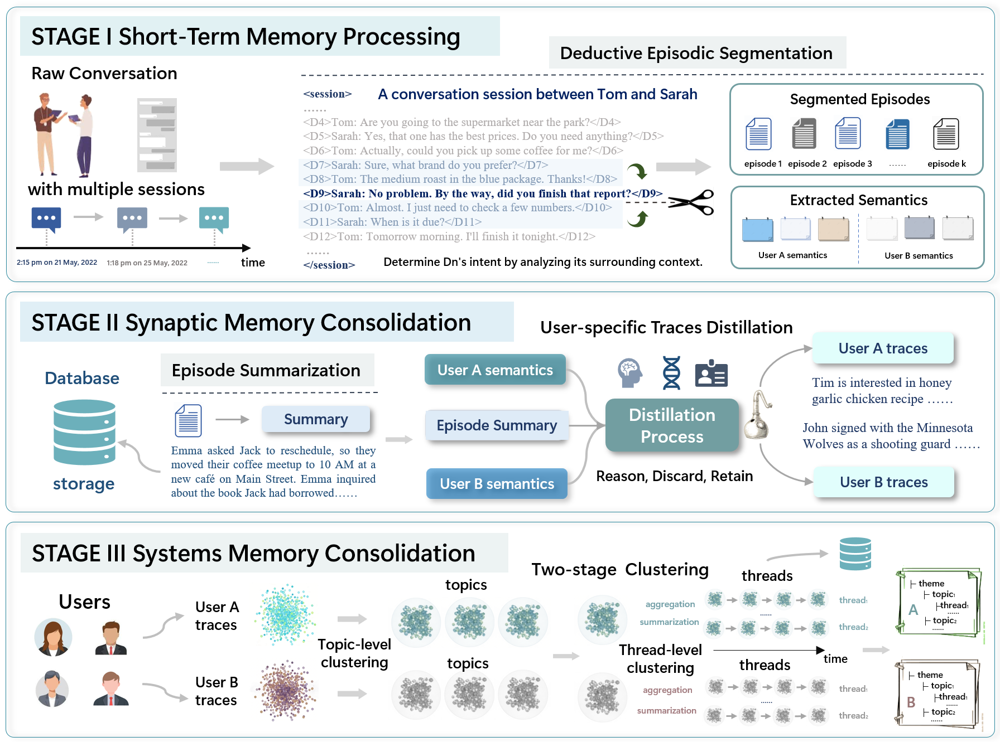

<div align="center">
  <!-- 图片 + 标题 水平排列 -->
  <div style="display: flex; align-items: center; justify-content: center; gap: 16px;">
    
    <h1 style="margin: 0;">TraceMem</h1>
  </div>
  <!-- 副标题单独一行，居中 -->
  <p style="margin-top: 8px;">
    <strong>Weaving Narrative Memory Schemata from User Conversational Traces</strong>
  </p>
  <p style="margin-top: 4px;">
    📖 <a href="https://arxiv.org/abs/2602.09712">[Paper]</a>
  </p>
</div>


## 📋 Contents

- [🏗️ Core Architecture](#-core-architecture)
- [🔍 Agentic Search](#-agentic-search)
- [⚙️ Installation](#-installation)
- [📊 Evaluation](#-evaluation)
- [✅ To Do List](#-to-do-list)
- [💬 Open Discussion](#-open-discussion)
- [🔗 Related Projects](#-related-projects)


## 🏗️ Core Architecture

TraceMem employs a three-stage pipeline to transform raw conversational traces into memory schemata:

### Short-Term Memory Processing

**Deductive Episodic Segmentation**: Demarcate episode boundaries by analyzing discourse intent.

**Semantic Extraction**: Generates semantic representations to structure key information from the dialogue flow.

### Synaptic Memory Consolidation

**Episode Summarization**: Condenses conversational episodes into episodic memories.

**User-Specific Trace Distillation**: Extract concrete biographical facts while discarding irrelevant noise.

### Systems Memory Consolidation

**Two-Stage Clustering**: Utilizes UMAP and HDBSCAN to organize experience traces into narrative threads.

**Narrative Schemata Formation**: Threads are woven into structured User Memory Cards.




## 🔍 Agentic Search

To utilize these memories, TraceMem employs an **Agentic Search** mechanism:

- **Episodic Memory Retrieval**: Searches top-K relevant memories.
- **Thread Extraction**: Strategically selects relevant memory cards and pinpoints specific narrative threads via unique thread IDs.


## ⚙️ Installation

```shell
conda create -n tracemem python=3.10
conda activate tracemem

git clone git@github.com:YimingShu-teay/TraceMem.git
cd TraceMem

pip install -e .
```


```shell
# Windows
$env:OPENAI_API_KEY="your openai key"
$env:BASE_URL="your choice"

# Linux
export OPENAI_API_KEY="your openai key"
export BASE_URL="your choice"

# you can also set in config.py or .env
```


## 📊 Evaluation

```python
python evaluation/locomo/add.py
python evaluation/locomo/build.py
python evaluation/locomo/answer.py
python evaluation/locomo/evals.py
python evaluation/locomo/generate_scores.py
```


## ✅ To Do List

- [💡 Examples](https://github.com/YimingShu-teay/TraceMem/tree/main/examples)
- [📁 Evaluation](https://github.com/YimingShu-teay/TraceMem/tree/main/evaluation)
- [🗃️ docs](https://github.com/YimingShu-teay/TraceMem/tree/main/docs)
- [🤖 More Models Support](https://github.com/YimingShu-teay/TraceMem/tree/main/src/tracemem)
- [🔌 MCP](https://github.com/YimingShu-teay/TraceMem/tree/main/mcp)
- [🔧 skills]()

## 💬 Open Discussion  
Delving into the mechanics of human memory, some studies support the fact that **memory is rewritten each time it is retrieved. Essentially, it means that every act of recollection holds the potential to update information or trigger subtle reorganizations**. This malleability is particularly intriguing for interactive agents, as an agent retrieves past experiences to inform current responses, its memory is not merely accessed but potentially reshaped, contributing to a dynamic where memory may evolve through active conversation and internal monologue, potentially leading to alterations over time.

**Such rewriting could enable the system to learn what to prioritize and what to disregard**. Much like the human brain, where seldom-accessed knowledge tends to decay, information that remains unvisited in long-term interactions may reflect aspects that no longer require reinforcement. Consequently, determining what to forget and at what rate emerges as a pivotal challenge. Therefore, memory rewriting upon retrieval and regulated forgetting may represent two crucial mechanisms for future development.

Looking ahead, we may develop agents endowed with diverse personality traits, ranging from irritable and easy-going to anxious or emotionally complex. **What they prioritize or disregard could also stem from these intrinsic characteristics**, thereby making the dynamics of memory even more intriguing.

**But even given such memory, should an agent utilize it at all times?** Determining when to invoke memory and when to abstain may be a critical focus for future research. Even in conversations with the same user, there are instances where a task can be performed perfectly well without accessing past data. In fact, incorporating excessive retrieved memories could potentially introduce interference, hindering the quality of the response. **Accordingly, an ideal memory system should evolve into a dynamic cognitive partner that can judiciously activate or suppress memories during exchanges**.


## 🔗 Related Projects

<table style="margin-left: 0; border-collapse: collapse;">
  <tr>
    <!-- A-mem -->
    <td align="center" width="180" style="padding: 8px;">
      <a href="https://github.com/agiresearch/A-mem" style="text-decoration: none; color: #111;">
        
        <br>
        <span style="font-size: 1.2rem; font-weight: 600; color: #1f2937;">A-mem</span>
      </a>
    </td>
    <!-- Nemori -->
    <td align="center" width="180" style="padding: 8px;">
      <a href="https://github.com/nemori-ai/nemori" style="text-decoration: none; color: #111;">
        
        <br>
        <span style="font-size: 1.2rem; font-weight: 600; color: #1f2937;">Nemori</span>
      </a>
    </td>
    <!-- LightMem -->
    <td align="center" width="180" style="padding: 8px;">
      <a href="https://github.com/zjunlp/LightMem" style="text-decoration: none; color: #111;">
        
        <br>
        <span style="font-size: 1.2rem; font-weight: 600; color: #1f2937;">LightMem</span>
      </a>
    </td>
  </tr>
</table>

